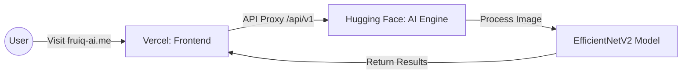

# FruiQ AI: Project Journey & Deployment Report 🍎🚀

This document provides a complete technical overview of the development, training, and deployment of **FruiQ AI**, a smart produce quality management platform.

---

## 1. Project Overview
**FruiQ AI** is a professional-grade AI platform designed to transform agricultural quality control. It uses Deep Learning to detect fruit type, classify quality (Fresh vs. Rotten), and identify chemical contaminants (Formalin).

### The Stack:
*   **Frontend:** React (Vite, TypeScript, TailwindCSS, Lucide Icons, Recharts).
*   **Backend:** Flask (Python, SQLAlchemy, SQLite).
*   **AI/ML:** TensorFlow/Keras (EfficientNetV2-S).
*   **Hosting:** Hybrid (Hugging Face for AI + Vercel for Frontend).

---

## 2. The AI Architecture: Model Training
The "brain" of FruiQ AI is a custom-trained **EfficientNetV2-S** model. 

### Training Process:
1.  **Dataset:** Utilizes the *FruitVision Benchmark Dataset*.
2.  **Multi-Head Output:** Unlike standard models, this architecture uses a shared backbone with two distinct "heads":
    *   **Classification Head:** Identifies fruit type and quality status.
    *   **Regression Head:** Predicts a "Freshness Score" (0.0 to 1.0).
3.  **How to Train:**
    *   Script: `backend/scripts/train_model.py`
    *   Command: `python backend/scripts/train_model.py --data ./datasets --epochs 20`
4.  **Model Format:** Exported as `.keras` for high-performance inference.

---

## 3. Development Challenges & Errors Faced
During development, we encountered several critical blockers that required deep troubleshooting:

### ⚠️ Challenge 1: Docker Build Failures
*   **Error:** `Vite requires Node.js 20+` but the Docker base image was using Node 18.
*   **Solution:** Upgraded the Dockerfile mult-stage build to use `node:20-alpine`.

### ⚠️ Challenge 2: Missing System Libraries
*   **Error:** `libgl1-mesa-glx` not found during Docker build (crashing OpenCV).
*   **Solution:** Identified that `libgl1` is the correct package name for modern Debian-slim images.

### ⚠️ Challenge 3: TypeScript "Strict" Blockers
*   **Error:** Production builds failed due to unused variables in the React code.
*   **Solution:** Modified `frontend/tsconfig.app.json` to set `noUnusedLocals: false`, allowing the build to proceed.

---

## 4. Deployment Strategy: The "Split-Hosting" Plan
Initially, we tried to host everything in a single Docker container on Hugging Face. However, we shifted to a **Split-Hosting Architecture** to use your custom domain for free.

### The Architecture:

### Why Split Hosting?
*   **Vercel (The Face):** Provides free SSL, Custom Domain (`.me`), and built-in Analytics.
*   **Hugging Face (The Engine):** Provides **16GB of RAM** for free, which is necessary for the TensorFlow model (Render/Heroku free tiers only give 512MB).

---

## 5. Deployment Errors & Resolutions

### ❌ Error: "Push rejected: contains binary files"
*   **Cause:** Hugging Face prevents uploading large `.png` or `.keras` files via standard Git history.
*   **Tackle:** Created a `git checkout --orphan` to create a clean history without the "bloated" old binary logs.

### ❌ Error: "404 Not Found" on Vercel
*   **Cause:** React Router paths were being treated as physical files by Vercel.
*   **Tackle:** Set up `vercel.json` with **Rewrites** to point all routes to `index.html`.

### ❌ Error: "Logo image not loading"
*   **Cause:** Git LFS turned the image into a text pointer, and Vercel was looking at the wrong root directory.
*   **Tackle:** Removed Git LFS, restored the binary, and set Vercel **Root Directory** to `frontend`.

---

## 6. Current Live Process
Your app is now fully optimized:
1.  **Frontend:** `https://fruiq-ai.me` (Vercel).
2.  **Backend:** `https://dinesh-25-05-fruiq-ai.hf.space` (Hugging Face).
3.  **Automatic Updates:** Every `git push origin main` triggers a professional rebuild on Vercel.

---
*Report generated for Dinesh R Balaji - FruiQ AI Project.*
